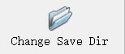

# 戴和不戴口罩图像分类开发文档

## 一、数据采集

使用爬虫对百度图库进行图片采集，可指定图片关键字和数量，python代码如下：

```python
import os
import requests
from faker import Faker


def download_images(keyword, num):
    """
    爬取百度图片搜索结果中指定关键词keyword的前 num 张图片，并下载到本地文件夹。
    :param keyword: 搜索关键词
    :param num: 需要下载的图片数量
    """
    # 创建保存图片的文件夹
    dir_name = f'downloads/{keyword}'
    if not os.path.exists(dir_name):
        os.makedirs(dir_name)

    count = 0
    page_num = 0

    # 持续爬取图片，直到达到指定数量
    while True:
        print(f'正在爬取第{page_num + 1}页...')

        # 待请求URL
        url = f'https://image.baidu.com/search/acjson?tn=resultjson_com&logid=11513145951136847483&ipn=rj&ct=201326592&is=&fp=result&fr=&word={keyword}&queryWord={keyword}&cl=2&lm=-1&ie=utf-8&oe=utf-8&adpicid=&st=-1&z=&ic=0&hd=&latest=&copyright=&s=&se=&tab=&width=&height=&face=0&istype=2&qc=&nc=1&expermode=&nojc=&isAsync=&pn={page_num * 30}&rn=30&gsm=5a&1683422786613='

        # 模拟请求头
        headers = {
            'User-Agent': Faker().user_agent()
        }

        # 发送 HTTP 请求，获取响应结果并解析 JSON 数据
        response = requests.get(url, headers=headers).json()

        # 遍历所有图片信息
        for image_info in response['data']:
            try:
                # 打印当前正在下载的图片的 URL
                print(f'正在下载第 {count} 张图片')
                print(image_info['thumbURL'])

                # 下载图片并保存到本地文件夹
                image_data = requests.get(image_info['thumbURL'], headers=headers)
                with open(os.path.join(dir_name, f'{keyword}_{count}.jpg'), 'wb') as f:
                    f.write(image_data.content)

                count += 1

                # 如果已经下载了足够数量的图片，则退出爬虫程序
                if count >= num:
                    print(f'一共下载了 {num} 张图片！！！！！！')
                    print(f'图片已保存至:{dir_name}')
                    return

            except:
                pass
        # 增加页数，以爬取下一页的图片
        page_num += 1


if __name__ == '__main__':
    download_images('戴口罩的人', num=200)
```

先采集戴口罩的人200张，爬取的数据如下：


注：爬取的原始数据在`downloads`下


## 二、数据初筛

人工对采集的图片进行初步筛选：删除质量不好的图片（如卡通的、非关键字的、质量差的等图片）：


复制并初筛后如下：


注：初筛后的数据在`preData`下


为了后续opencv的读取，需要将这些图片名进行重命名，含中文后续可能会报错，批量进行重命名，代码如下：

```python
import os

source_dir = 'preData/mask'  # 源文件夹路径
k = 1
for filename in os.listdir(source_dir):
    if "jpg" in filename:
        old_path = os.path.join(source_dir, filename)  # 原始文件路径
        new_path = os.path.join(source_dir, "mask_" + str(k) + ".jpg")  # 新文件路径
        os.rename(old_path, new_path)  # 重命名文件
        k += 1
```


## 三、数据预处理

将初步筛选后的数据进一步处理:

1、先使用labelImg先对戴口罩区域进行标注；

2、再通过脚本对标注区域进行提取并保存；

最终形成戴口罩的数据集。


### 1、labelimg标注

1）安装：

`pip install labelimg`

2）启动：

`labelimg`


启动后界面如下：


3）标注：
a：先打开待标注的数据文件夹


b：设置标注文件的保存路径



c：保存格式设置为PascalVoc


d：w为标注模式，拖拉即可标注，设置标签名mask即可，注意保存ctrl+s，下一张为快捷键D，效果如下：


将所有戴口罩的标注完成即可；


标注文件如下：


接下去就是需要通过这些标注文件对标注区域进行提取并保存为图片；


### 2、提取标注区域

对xml批量处理，裁剪出标注区域的图片，并另存为，代码如下：

```
# -*- codeing = utf-8 -*-
# @Time :2023/5/7 18:33
# @Author :yujunyu
# @Site :
# @File :extract_ROI.py
# @software: PyCharm
import os
import xml.etree.ElementTree as ET
import cv2

k = 1

# xml文件夹路径
xml_path = 'preData/anno_mask'
for filename in sorted(os.listdir(xml_path)):
    # print(filename)

    # 加载xml文件
    annotation_file = os.path.join(xml_path, filename)
    tree = ET.parse(annotation_file)
    root = tree.getroot()

    # 原始图片
    img_path = root.find('path').text
    img = cv2.imread(img_path)
    # cv2.imshow('img', img)
    # cv2.waitKey(0)
    # cv2.destroyAllWindows()

    # 解析标注信息
    for i in root.findall('object'):
        # 解析标签名、标注坐标
        label = i.find('name').text
        xmin = int(i.find('bndbox').find('xmin').text)
        ymin = int(i.find('bndbox').find('ymin').text)
        xmax = int(i.find('bndbox').find('xmax').text)
        ymax = int(i.find('bndbox').find('ymax').text)
        print(label)
        print(xmin, ymin, xmax, ymax)

        # 裁剪标注区域
        img1 = img[ymin:ymax, xmin:xmax]

        # 保存
        save_dir = 'dataset/mask'
        if not os.path.exists(save_dir):
            os.makedirs(save_dir)
        cv2.imwrite(os.path.join(save_dir, 'mask_' + str(k) + '.jpg'), img1)

        k += 1
```

注：保存至`dataset/mask`下

效果如下：


没有戴口罩同上操作再来一遍即可；


## 模型搭建

搭建一个cnn，输入的图片为3通道、大小为224×224；

```python
class CNN(nn.Module):
    def __init__(self, num_classes):
        super(CNN, self).__init__()
        self.conv1 = nn.Conv2d(3, 16, kernel_size=3, stride=1, padding=1)
        self.relu1 = nn.ReLU()
        self.pool1 = nn.MaxPool2d(kernel_size=2, stride=2)
        self.conv2 = nn.Conv2d(16, 32, kernel_size=3, stride=1, padding=1)
        self.relu2 = nn.ReLU()
        self.pool2 = nn.MaxPool2d(kernel_size=2, stride=2)
        self.conv3 = nn.Conv2d(32, 64, kernel_size=3, stride=1, padding=1)
        self.relu3 = nn.ReLU()
        self.pool3 = nn.MaxPool2d(kernel_size=2, stride=2)
        self.fc1 = nn.Linear(64 * 28 * 28, 512)
        self.relu4 = nn.ReLU()
        self.dropout1 = nn.Dropout(0.5)
        self.fc2 = nn.Linear(512, num_classes)

    def forward(self, x):
        x = self.conv1(x)
        x = self.relu1(x)
        x = self.pool1(x)
        x = self.conv2(x)
        x = self.relu2(x)
        x = self.pool2(x)
        x = self.conv3(x)
        x = self.relu3(x)
        x = self.pool3(x)
        x = x.view(-1, 64 * 28 * 28)
        x = self.fc1(x)
        x = self.relu4(x)
        x = self.dropout1(x)
        x = self.fc2(x)
        return x
class LeNet5(nn.Module):
    def __init__(self, num_classes):
        super(LeNet5, self).__init__()
        self.conv1 = nn.Conv2d(3, 6, kernel_size=5, stride=1, padding=2)
        self.pool1 = nn.MaxPool2d(kernel_size=2, stride=2)
        self.conv2 = nn.Conv2d(6, 16, kernel_size=5, stride=1)
        self.pool2 = nn.MaxPool2d(kernel_size=2, stride=2)
        self.fc1 = nn.Linear(16 * 56 * 56, 120)
        self.fc2 = nn.Linear(120, 84)
        self.fc3 = nn.Linear(84, num_classes)

    def forward(self, x):
        x = self.conv1(x)
        x = torch.relu(x)
        x = self.pool1(x)
        x = self.conv2(x)
        x = torch.relu(x)
        x = self.pool2(x)
        x = x.view(-1, 16 * 56 * 56)
        x = self.fc1(x)
        x = torch.relu(x)
        x = self.fc2(x)
        x = torch.relu(x)
        x = self.fc3(x)
        return x

model = LeNet5(num_classes=2)
print(model)
```


## 模型训练

训练分类模型

```python
# 定义数据增强和预处理操作
transform = transforms.Compose([
    transforms.Resize((224, 224)),   # 调整图像大小为224x224
    transforms.ToTensor(),           # 转换为张量
    transforms.Normalize(mean=[0.5, 0.5, 0.5], std=[0.5, 0.5, 0.5])  # 标准化
])

# 加载带标签的图像数据集，并划分训练集和测试集
dataset = ImageFolder(root='dataset', transform=transform)
train_size = int(0.8 * len(dataset))
test_size = len(dataset) - train_size
train_dataset, test_dataset = torch.utils.data.random_split(dataset, [train_size, test_size])

# 定义数据加载器
train_loader = torch.utils.data.DataLoader(train_dataset, batch_size=32, shuffle=True)
test_loader = torch.utils.data.DataLoader(test_dataset, batch_size=32, shuffle=False)

# 定义模型
model = CNN(num_classes=2)

# 定义损失函数和优化器
criterion = nn.CrossEntropyLoss()
optimizer = torch.optim.Adam(model.parameters(), lr=0.001)

best_acc = 0
epochs = 10
for epoch in range(epochs):
    # 训练模型
    model.train()
    train_loss = 0
    train_correct = 0
    train_total = 0
    for images, labels in train_loader:
        optimizer.zero_grad()
        outputs = model(images)
        loss = criterion(outputs, labels)
        loss.backward()
        optimizer.step()
        train_loss += loss.item()
        _, predicted = torch.max(outputs.data, 1)
        train_total += labels.size(0)
        train_correct += (predicted == labels).sum().item()

    # 在测试集上计算准确率
    model.eval()
    test_loss = 0
    test_correct = 0
    test_total = 0
    with torch.no_grad():
        for images, labels in test_loader:
            outputs = model(images)
            loss = criterion(outputs, labels)
            test_loss += loss.item()
            _, predicted = torch.max(outputs.data, 1)
            test_total += labels.size(0)
            test_correct += (predicted == labels).sum().item()

    train_loss /= len(train_loader)
    train_acc = 100 * train_correct / train_total
    test_loss /= len(test_loader)
    test_acc = 100 * test_correct / test_total
    print('Epoch [{}/{}]\tTrain Loss: {:.4f}\tTrain Acc: {:.2f}%\tTest Loss: {:.4f}\tTest Acc: {:.2f}%'
          .format(epoch+1, epochs, train_loss, train_acc, test_loss, test_acc))

    # 保存最好的模型参数
    if test_acc > best_acc:
        torch.save(model.state_dict(), 'best_model.pth')
        best_acc = test_acc
```

训练打印如下：

```
C:\Users\yujunyu\.conda\envs\pytorch\python.exe D:/PycharmProject(D)/kz_demo/train.py
Epoch [1/10]	Train Loss: 0.9244	Train Acc: 58.33%	Test Loss: 0.4006	Test Acc: 75.51%
Epoch [2/10]	Train Loss: 0.4166	Train Acc: 78.65%	Test Loss: 0.1748	Test Acc: 95.92%
Epoch [3/10]	Train Loss: 0.1443	Train Acc: 96.88%	Test Loss: 0.0624	Test Acc: 97.96%
Epoch [4/10]	Train Loss: 0.0649	Train Acc: 97.92%	Test Loss: 0.0944	Test Acc: 97.96%
Epoch [5/10]	Train Loss: 0.0232	Train Acc: 98.96%	Test Loss: 0.0984	Test Acc: 97.96%
Epoch [6/10]	Train Loss: 0.0132	Train Acc: 99.48%	Test Loss: 0.1068	Test Acc: 97.96%
Epoch [7/10]	Train Loss: 0.0024	Train Acc: 100.00%	Test Loss: 0.1299	Test Acc: 97.96%
Epoch [8/10]	Train Loss: 0.0056	Train Acc: 100.00%	Test Loss: 0.1367	Test Acc: 97.96%
Epoch [9/10]	Train Loss: 0.0014	Train Acc: 100.00%	Test Loss: 0.1239	Test Acc: 97.96%
Epoch [10/10]	Train Loss: 0.0015	Train Acc: 100.00%	Test Loss: 0.1458	Test Acc: 97.96%

Process finished with exit code 0
```


## 预测

使用非数据集进行预测

```python
# -*- codeing = utf-8 -*-
# @Time :2023/5/7 21:35
# @Author :yujunyu
# @Site :
# @File :pre_img.py
# @software: PyCharm
import cv2
import torch
import torchvision
from torchvision import transforms
from PIL import Image


class CNN(torch.nn.Module):
    def __init__(self, num_classes):
        super(CNN, self).__init__()
        self.conv1 = torch.nn.Conv2d(3, 16, kernel_size=3, stride=1, padding=1)
        self.relu1 = torch.nn.ReLU()
        self.pool1 = torch.nn.MaxPool2d(kernel_size=2, stride=2)
        self.conv2 = torch.nn.Conv2d(16, 32, kernel_size=3, stride=1, padding=1)
        self.relu2 = torch.nn.ReLU()
        self.pool2 = torch.nn.MaxPool2d(kernel_size=2, stride=2)
        self.conv3 = torch.nn.Conv2d(32, 64, kernel_size=3, stride=1, padding=1)
        self.relu3 = torch.nn.ReLU()
        self.pool3 = torch.nn.MaxPool2d(kernel_size=2, stride=2)
        self.fc1 = torch.nn.Linear(64 * 28 * 28, 512)
        self.relu4 = torch.nn.ReLU()
        self.dropout1 = torch.nn.Dropout(0.5)
        self.fc2 = torch.nn.Linear(512, num_classes)

    def forward(self, x):
        x = self.conv1(x)
        x = self.relu1(x)
        x = self.pool1(x)
        x = self.conv2(x)
        x = self.relu2(x)
        x = self.pool2(x)
        x = self.conv3(x)
        x = self.relu3(x)
        x = self.pool3(x)
        x = x.view(-1, 64 * 28 * 28)
        x = self.fc1(x)
        x = self.relu4(x)
        x = self.dropout1(x)
        x = self.fc2(x)
        return x


# 定义数据增强和预处理操作
transform = transforms.Compose([
    transforms.Resize((224, 224)),  # 调整图像大小为224x224
    transforms.ToTensor(),  # 转换为张量
    transforms.Normalize(mean=[0.5, 0.5, 0.5], std=[0.5, 0.5, 0.5])  # 标准化
])

# 加载模型参数
model = CNN(num_classes=2)
model.load_state_dict(torch.load('best_model.pth'))
model.eval()

# 加载图像
img_path = 'nomask.png'
img = Image.open(img_path)

# 进行预处理
img = transform(img)

# label_map
label_map = ['mask', 'nomask']

# 使用模型进行预测
with torch.no_grad():
    outputs = model(img)
    probs = torch.softmax(outputs, dim=1)
    p, cls = torch.max(probs, 1)
    print('待预测图片:{}\t预测概率:{}\t预测标签:{}'.format(img_path, p.numpy()[0], label_map[cls]))

    # 可视化
    img = cv2.imread(img_path)
    cv2.putText(img, 'p:{:.2f} cls:{}'.format(p.numpy()[0], label_map[cls]), (10, 30), cv2.FONT_HERSHEY_SIMPLEX, 1, (0, 0, 255), 2)
    cv2.imshow('res', img)
    cv2.waitKey(0)

```

效果如下：


